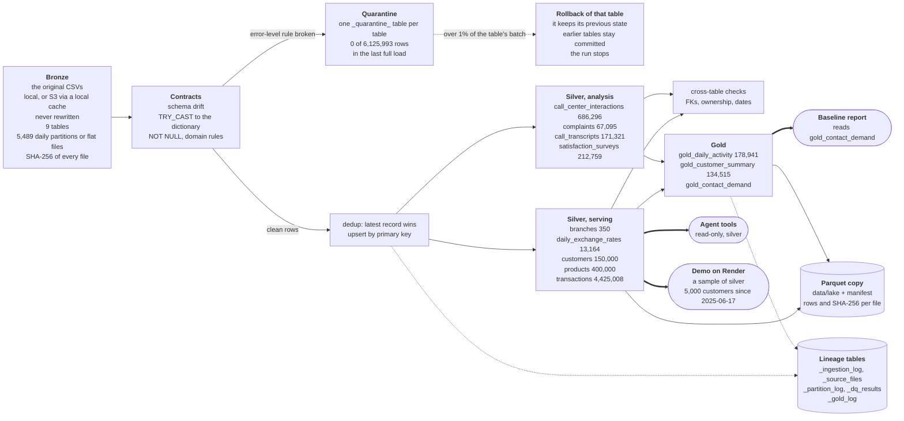

# Data engineering at a glance

<!-- Generated by `python -m eval.data_page`; tests/test_data_page.py fails if this page differs. Do not edit by hand. -->

How the organizer's files become the rows the agent answers from, and how each step can be checked.

Every figure is read from a committed report: [`quality_report.json`](../data/reports/quality_report.json) (the last full load), [`lake_manifest.json`](evidence/lake_manifest.json) (the Parquet export) and the code.

The detail behind each section:

- [data_engineering.md](data_engineering.md): layers, measured load times, guarantees and their tests, what is not built
- [data_quality.md](data_quality.md): contract, checks, findings, freshness
- [data-validation-catalog.md](data-validation-catalog.md): each defect of the dataset and its rule
- [dataset-audit.md](dataset-audit.md): the audit of the dataset

## The flow



Each table is loaded and committed in its own transaction. A table rolls back when more than 1% of its own batch is quarantined (`--max-quarantine-rate`, strictly greater) or a required column is missing. The affected table keeps its previous state; earlier tables in the run stay committed, and the run stops there.

Gold is committed mart by mart. A mart that fails its column contract, its grain or its reconciliation to silver keeps its previous version; marts built before it in that build stay, and the build stops.

The agent reads silver; only the baseline report reads gold. The demo on Render loads a sample, `--profile serving --sample-customers 5000 --since 2025-06-17` ([render.yaml](../render.yaml)), so the counts below are not the demo's.

## Each layer in numbers

The figures come from two committed artifacts:

- **Silver:** the last full load, `20260929T145046Z-12c946`: 9 tables, 6,125,993 rows.
- **Gold and the export:** the Parquet copy of a full-data warehouse with 6 of those tables (`branches`, `daily_exchange_rates`, `customers`, `products`, `transactions`, `complaints`).

Where both have a table, its row count agrees. `gold_contact_demand` needs `call_center_interactions`, which that warehouse lacks, so it is not in the export; its one measured row count is in [data_engineering.md](data_engineering.md#the-gold-marts).

| Layer | Table | Rows loaded in the last full load | Rows in the Parquet export | Quarantined | Read by |
|---|---|---|---|---|---|
| Silver (serving) | `branches` | 350 | 350 | 0 | none |
| Silver (serving) | `daily_exchange_rates` | 13,164 | 13,164 | 0 | agent: [`account_tools.py`](../agent/tools/account_tools.py) |
| Silver (serving) | `customers` | 150,000 | 150,000 | 0 | agent: [`identity.py`](../agent/session/identity.py), [`account_tools.py`](../agent/tools/account_tools.py)<br>API and demo: [`customer_context.py`](../api/customer_context.py)<br>analysis: [`baseline_contact_center.py`](../analysis/baseline_contact_center.py), [`label_scan.py`](../analysis/label_scan.py) |
| Silver (serving) | `products` | 400,000 | 400,000 | 0 | agent: [`account_tools.py`](../agent/tools/account_tools.py)<br>API and demo: [`customer_context.py`](../api/customer_context.py), [`demo.py`](../api/demo.py)<br>analysis: [`baseline_contact_center.py`](../analysis/baseline_contact_center.py) |
| Silver (serving) | `transactions` | 4,425,008 | 4,425,008 | 0 | agent: [`account_tools.py`](../agent/tools/account_tools.py)<br>API and demo: [`customer_context.py`](../api/customer_context.py), [`observability.py`](../api/observability.py)<br>analysis: [`baseline_contact_center.py`](../analysis/baseline_contact_center.py), [`behavior_association.py`](../analysis/behavior_association.py), [`label_signal.py`](../analysis/label_signal.py) |
| Silver (analysis) | `call_center_interactions` | 686,296 | not in the export | 0 | analysis: [`baseline_contact_center.py`](../analysis/baseline_contact_center.py), [`label_scan.py`](../analysis/label_scan.py) |
| Silver (analysis) | `complaints` | 67,095 | 67,095 | 0 | none |
| Silver (analysis) | `call_transcripts` | 171,321 | not in the export | 0 | analysis: [`baseline_contact_center.py`](../analysis/baseline_contact_center.py) |
| Silver (analysis) | `satisfaction_surveys` | 212,759 | not in the export | 0 | analysis: [`baseline_contact_center.py`](../analysis/baseline_contact_center.py), [`label_scan.py`](../analysis/label_scan.py) |
| Gold | `gold_daily_activity` | built from silver | 178,941 | rolls back instead | none |
| Gold | `gold_customer_summary` | built from silver | 134,515 | rolls back instead | none |
| Gold | `gold_contact_demand` | built from silver | not in the export | rolls back instead | analysis: [`baseline_contact_center.py`](../analysis/baseline_contact_center.py) |

There is no separate bronze store. The pipeline reads the original CSVs, either from a local directory or from a local cache of the S3 objects under `--raw-dir` (downloaded as they are, never rewritten). The hash in `_source_files` proves which bytes were read. "Read by" lists the modules under `agent/`, `api/` and `analysis/` that query the table.

## One row, end to end

Transaction `TXN-FIX0002` of the hand-made fixture, loaded by the real pipeline. Anyone can rebuild it without S3 (commands below). On a full warehouse the same command traces any row; the copy the export below was written from was loaded before `_source_files` existed, so `make lineage` fails on it until it is loaded again, and the hashed example is the fixture's.

**1. Bronze: the delivered bytes.** Line 3 of [`transactions/year=2024/month=01/day=14/transactions_20240114.csv`](../tests/fixtures/raw/transactions/year=2024/month=01/day=14/transactions_20240114.csv), 791 bytes, SHA-256 `397e12c6c356e5bb090556f56d5c291ffd9e78bcd8e1430cf280f981c821837b`:

```csv
transaction_id,transaction_date,process_date,product_id,customer_id,transaction_type,transaction_category,amount,currency,amount_usd,channel,branch_id,merchant_name,merchant_category,transaction_country,transaction_city,transaction_status,response_code,is_fraud,fraud_score,latitude,longitude
TXN-FIX0002,2024-01-14 13:40:00,2024-01-14,PRD-FIX0004,CLI-FIX0001,Purchase,Food,85.20,USD,85.20,POS,,Restaurante Fixture,5812,México,Ciudad de México,Approved,00,false,5.00,19.4300000,-99.1300000
```

**2. Contracts it passed** (contract 2.1.0, [`data/contracts.py`](../data/contracts.py)). Every value cast to its dictionary type. The row's own values against its table's rules:

| Rule | Severity | This row |
|---|---|---|
| NOT NULL on 12 columns (`transaction_id`, `transaction_date`, `process_date`, `product_id`, `customer_id`, `transaction_type`, `amount`, `currency`, `channel`, `transaction_country`, `transaction_status`, `is_fraud`) | error | pass |
| `type_enum` | error | pass |
| `status_enum` | error | pass |
| `channel_enum` | error | pass |
| `currency_enum` | error | pass |
| `amount_positive` | error | pass |
| `fraud_score_range` | error | pass |
| `usd_amount_present` | warn | pass |
| `usd_amount_matches_for_usd` | warn | pass |
| `not_late_arrival` | warn | pass |

An error-level failure would have sent the row to `_quarantine_transactions` with the rule's name. This load quarantined nothing (no quarantine table). Its batch-level cross-table checks: `cross:customer_owns_product` 0/10 failed, `cross:customers_not_updated_after_as_of` 5/5 failed, `cross:fk_product` 0/10 failed, `cross:products_not_updated_after_as_of` 12/12 failed, `cross:tx_not_before_customer_registration` 0/10 failed, `cross:tx_not_before_product_opening` 0/10 failed. The failing ones count dimension rows last updated after the fixture's as-of date (2024-01-16); they are warnings and change nothing.

**3. Silver: the typed row and its lineage.** `transactions` row `TXN-FIX0002`: `transaction_date` = 2024-01-14 13:40:00, `customer_id` = CLI-FIX0001, `product_id` = PRD-FIX0004, `transaction_type` = Purchase, `amount` = 85.20, `currency` = USD, `transaction_status` = Approved. It carries `_source_file` = `transactions/year=2024/month=01/day=14/transactions_20240114.csv`, `_run_id` (the load's id) and `_ingested_at`. The load's row in `_ingestion_log` records mode `full`, contract `2.1.0`, the code version, the parameters and the machine; `_source_files` records the file with the same SHA-256.

**4. Gold: the marts it adds to.** In `gold_daily_activity`, the row for `activity_date` = 2024-01-14, `transaction_country` = México, `currency` = USD, `transaction_type` = Purchase, `transaction_status` = Approved counts 1 transaction from 1 customer, 85.20 in absolute amount. In `gold_customer_summary`, `CLI-FIX0001` has 6 movements on 4 products.

**5. The agent.** [`account_tools.py`](../agent/tools/account_tools.py) reads `transactions` from silver, never gold: `list_transactions` returns this movement to `CLI-FIX0001` once the session is bound to that customer, with the warehouse's as-of date.

## Run ids, as-of and hashes

Every pipeline invocation gets one run id, `YYYYMMDDTHHMMSSZ-` plus six hex characters (UTC start time and a random suffix; the last full load is `20260929T145046Z-12c946`). It is written to every row it loads (`_run_id`), to `_ingestion_log`, `_source_files`, `_partition_log` and `_dq_results`, and to quarantined rows (`_quarantine_run`). A gold build has its own id in `_gold_log` and on every mart row (`_gold_run_id`).

**As-of.** The warehouse's as-of date is the last processed day of `transactions`: **2026-06-17** for the organizer's data ([baseline_metrics.json](evidence/baseline_metrics.json)), 2024-01-16 for the fixture. A reply that presents data read from the warehouse (balances, movements, payment status) states it. Clarifications, abstentions and some trace replies carry no date. The freshness policy is in [data_quality.md](data_quality.md#update-and-freshness-policy).

**Source hashes.** `_source_files` keeps the size and SHA-256 of every file a load read, flat tables included. `make lineage` (`python -m data.lineage --verify --raw-dir $RAW_DATA_DIR`) exits 1 if a served row has no lineage, names a run that did not succeed or a file with no hash, or if a file on disk no longer has the recorded hash.

**Export hashes.** [`lake_manifest.json`](evidence/lake_manifest.json) is the manifest `make lake` wrote for the warehouse copy described above (2026-10-03, code `55193cda`): silver from load `20260929T143939Z-5c15cb`, gold from build `20261003T030434Z-c2c07d`, 8 files, 253,726,442 bytes.

| File | Rows | Bytes | SHA-256 (first 16) |
|---|---|---|---|
| `silver/branches.parquet` | 350 | 22,222 | `80db868b8b8696b5` |
| `silver/daily_exchange_rates.parquet` | 13,164 | 131,452 | `f9f8a5e51628b3ed` |
| `silver/customers.parquet` | 150,000 | 11,353,286 | `1271d640f6875cc9` |
| `silver/products.parquet` | 400,000 | 19,150,781 | `10bccd180c5965b4` |
| `silver/transactions.parquet` | 4,425,008 | 214,108,402 | `7ff4af16a3a2f685` |
| `silver/complaints.parquet` | 67,095 | 3,415,469 | `b96f8d760f9c5106` |
| `gold/gold_daily_activity.parquet` | 178,941 | 2,513,312 | `b9cbdce93a4a7b41` |
| `gold/gold_customer_summary.parquet` | 134,515 | 3,031,518 | `47d77abd6a451828` |

`make lake VERIFY=1` re-hashes each file, reads its rows and schema back and, with the warehouse, compares the row counts; an edited, truncated, swapped or missing file fails. The Parquet files are not in the repository, and a new export has other bytes (its rows carry their run ids and build times), so these hashes check that export, not a re-run.

## Quality checks of the last full load

Rules are declared in [`data/contracts.py`](../data/contracts.py) and run by [`data/quality.py`](../data/quality.py), inside each table's load transaction ([`data/pipeline.py`](../data/pipeline.py)). Tests: [`test_pipeline.py`](../tests/test_pipeline.py) (contracts, quarantine, rollback, late partitions, schema evolution), [`test_cross_checks.py`](../tests/test_cross_checks.py), [`test_data_ml_validation.py`](../tests/test_data_ml_validation.py) (one test per documented claim), [`test_gold.py`](../tests/test_gold.py), [`test_lake.py`](../tests/test_lake.py) and [`test_data_page.py`](../tests/test_data_page.py) (this page).

| Category | What it checks | Severity | Checks | Passed | Failed | Not run |
|---|---|---|---|---|---|---|
| `schema` | Columns against the contract: a missing required column fails the load; missing optional or new columns warn | error | 9 | 9 | 0 | 0 |
| `schema` |  | warn | 18 | 18 | 0 | 0 |
| `not_null` | Columns the dictionary declares NOT NULL | error | 98 | 98 | 0 | 0 |
| `uniqueness` | Primary-key duplicates in the batch, before dedup | warn | 9 | 9 | 0 | 0 |
| `domain` | Enums, ranges and business rules per table | error | 26 | 26 | 0 | 0 |
| `domain` |  | warn | 15 | 7 | 8 | 0 |
| `contract_sample` | An independent pydantic model of the row, on a sample of up to 1,000 rows | error | 9 | 9 | 0 | 0 |
| `cross_table` | Foreign keys, ownership, dates against the parent rows, unique keys besides the primary key | warn | 18 | 10 | 8 | 0 |
| `dependency` | A cross-table check whose parent table is not loaded: recorded as not run, never as passed | info | 1 | – | – | 1 |
| `gate` | The table's quarantine rate against the rollback threshold | info | 9 | – | – | 0 |
| `profile` | Null rate of every nullable column (a measurement, no pass or fail) | info | 83 | – | – | 0 |
| **Total** | | | **295** | | **16** | **1** |

Last full load `20260929T145046Z-12c946` (2026-09-29, contract 2.1.0, code `0f05d83`): **294 checks run, 0 errors failed, 16 warnings failed, 1 not run**, status `success`. No `type` check appears because one is recorded only when a value fails its cast. The failed warnings, each kept and counted rather than quarantined (what the system does about each one is in [data_quality.md](data_quality.md#findings-on-the-supplied-data)):

| Table | Check | Failed | Of |
|---|---|---|---|
| `customers` | `cross:fk_registration_branch` | 149,995 | 150,000 |
| `products` | `rule:credit_fields_present` | 12,983 | 400,000 |
| `products` | `rule:closed_has_zero_balance` | 31,156 | 400,000 |
| `products` | `cross:product_number_unique` | 6 | 400,000 |
| `transactions` | `rule:usd_amount_present` | 2,537,456 | 4,425,008 |
| `transactions` | `cross:tx_not_before_product_opening` | 827,610 | 4,425,008 |
| `transactions` | `cross:tx_not_before_customer_registration` | 829,540 | 4,425,008 |
| `transactions` | `cross:products_not_updated_after_as_of` | 25,113 | 400,000 |
| `transactions` | `cross:customers_not_updated_after_as_of` | 9,316 | 150,000 |
| `call_center_interactions` | `rule:reason_category_in_dictionary` | 20,578 | 686,296 |
| `call_center_interactions` | `cross:contact_not_before_registration` | 128,316 | 686,296 |
| `complaints` | `rule:claimed_amount_has_currency` | 1,040 | 67,095 |
| `complaints` | `rule:resolved_has_evidence` | 1,549 | 67,095 |
| `complaints` | `cross:customer_owns_affected_product` | 44,570 | 44,570 |
| `call_transcripts` | `rule:agent_text_rendered` | 171,321 | 171,321 |
| `call_transcripts` | `rule:dictionary_not_null:duration_seconds` | 24,029 | 171,321 |

`make validate-data-ml` (part of `make gate` and CI) holds the claims about contracts, quality, lineage and freshness, and the classifier's claims, to tests: the committed evidence ([data_ml_validation.md](evidence/data_ml_validation.md), 2026-09-29, code `0d71649`) has contracts PASS (11 tests), quality PASS (2 tests), lineage PASS (13 tests), freshness PASS (4 tests), learned PASS (5 tests), leakage PASS (8 tests).

## Reproduce

```bash
# The whole chain on the fixture, no S3 and no keys; /tmp keeps the committed report untouched
make pipeline INGEST=ingest-local RAW_DATA_DIR=tests/fixtures/raw DUCKDB_PATH=/tmp/cecilai.duckdb QUALITY_REPORT=/tmp/quality.json
DUCKDB_PATH=/tmp/cecilai.duckdb python -m data.lineage --row transactions TXN-FIX0002   # the row above
DUCKDB_PATH=/tmp/cecilai.duckdb python -m data.lineage                           # per table: last load, files, hashes

# The full dataset: ingest -> gold -> gold VERIFY -> lineage -> lake -> lake VERIFY, stopping at the first failure
make pipeline                                            # from the organizer's S3 bucket
make pipeline INGEST=ingest-local RAW_DATA_DIR=data/raw  # from a local copy

make validate-data-ml   # contracts, quality, lineage and freshness as PASS/FAIL; writes nothing
python -m eval.data_page   # regenerate this page in docs/ (--out elsewhere, --tmp-dir for the throwaway warehouse)
```

`make pipeline` with no variables writes the warehouse to `DUCKDB_PATH` and the report to `data/reports/quality_report.json`, the committed one this page reads.
