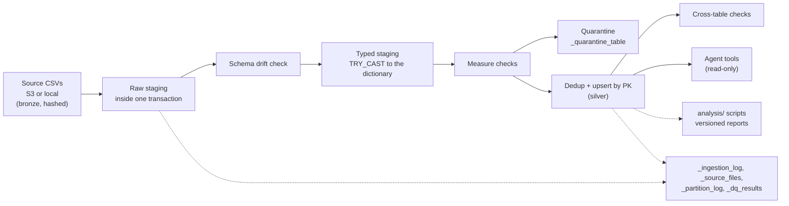

# Data engineering: layers, measured load, guarantees

`docs/data_quality.md` has the contract, checks and findings; this page says how the data flows, what a full load costs,
which guarantees are tested, and what we did not build.

## The layers, by their usual names

We did not build a Delta lakehouse. We have the same separation of concerns inside one DuckDB file, and we say where it
differs from a textbook medallion:

| Layer | In this repository | Differs from a textbook layer in |
|---|---|---|
| **Bronze**: the data as delivered | The organizer's CSV files, left where they are (S3 or a local directory) and never rewritten. Each load records every file's size and SHA-256 in `_source_files` | Not copied into our storage: the hash is the proof of what was read. A raw staging table exists only inside the load's transaction |
| **Silver**: typed, validated, de-duplicated | `branches`, `customers`, `products`, `transactions`, `daily_exchange_rates`: `TRY_CAST` to the dictionary's types, contract checks, bad rows moved to `_quarantine_<table>`, latest record wins, upsert by primary key. Every row carries `_source_file`, `_run_id`, `_ingested_at` | One layer serves the agent directly: there is no separate cleaned copy |
| **Gold**: business-ready aggregates | **Not built as tables.** Aggregates are computed on demand by scripts and published as versioned reports: `docs/evidence/baseline_metrics.md`, `docs/evidence/label_signal.md`, `docs/evidence/behavior_association.md` (`analysis/`) | There is no materialized mart, no feature store, and nothing scheduled that refreshes them |

A load whose quarantine rate passes `--max-quarantine-rate` (1% by default) or that lacks a required column rolls back,
and the warehouse keeps its previous state (`data/pipeline.py`).

## What a full load costs (measured)

From `_ingestion_log` of the full warehouse built on 2026-09-29 (contract 2.0.0, code `c7a219a`), serving profile, DuckDB
on one developer machine; no other load ran at the same time:

| Table | Files | Size | Rows | Quarantined | Seconds |
|---|---|---|---|---|---|
| branches | 1 | 0.1 MB | 350 | 0 | 2.6 |
| daily_exchange_rates | 1 | 0.8 MB | 13,164 | 0 | 0.2 |
| customers | 1 | 46.9 MB | 150,000 | 0 | 3.2 |
| products | 1 | 68.2 MB | 400,000 | 0 | 6.5 |
| transactions | 1,097 | 808.3 MB | 4,425,008 | 0 | 130.4 |
| **Total** | **1,101** | **924 MB** | **4,988,522** | **0** | **142.9** |

About 35,000 rows per second on `transactions`. The hardware is not recorded in the log, so read these as an order of
magnitude, not a benchmark. The organizer's other four tables (the analysis profile, about 18 million rows more) were
not timed here.

## Guarantees and the test that holds each one

| Guarantee | Test |
|---|---|
| Contracts, de-duplication and lineage columns on every row | `tests/test_pipeline.py::test_contracts_dedup_and_lineage` |
| A re-delivered or late partition updates in place; replays change nothing | `test_late_arriving_partition_updates_in_place_and_is_idempotent`, `test_s3_partition_replay_is_idempotent` |
| `--incremental` reads only the lookback window | `test_incremental_reads_only_the_lookback_window` |
| Over the quarantine threshold the load rolls back; under it, rows are quarantined | `test_quality_gate_rolls_back_then_quarantines_under_threshold` |
| A new column is added, not dropped; a missing required column fails | `test_schema_evolution_adds_new_column`, `test_complaints_quality_gate_and_missing_schema_roll_back` |
| Lineage times are UTC whatever the machine's time zone | `test_lineage_times_are_utc_whatever_the_machine_time_zone` |
| A served row traces back to its load and its file's hash | `python -m data.lineage --verify --raw-dir data/raw` (`make lineage`) |
| Contracts, quality, lineage and freshness pass as a whole | `make validate-data-ml`, which CI runs through `make gate` |

## What we did not build

- **No Parquet or Delta layer, no Databricks.** DuckDB over CSV, loaded in one process.
- **No separate gold tables** (see the table above).
- **No scheduler for ingestion.** A load is a command (`make ingest`), run by hand or at deploy. Only retention runs on a
  schedule.
- **The deployment serves a sample.** Render loads 5,000 customers since 2025-06-17 (`render.yaml`), not the full estate,
  because of its 512 MB instance.
- **One writer.** The warehouse is one DuckDB file; there is no concurrent loading.
